# 🔐 Smart Contract Security Auditor

<div align="center">


[](https://yourportfolio.com)
[](https://linkedin.com/in/yourprofile)
[](https://twitter.com/yourhandle)
[](mailto:your.email@example.com)


</div>

---

## 🎯 About Me


```solidity
contract Auditor {
    string public name = "Your Name";
    string public role = "Smart Contract Security Researcher";
    uint256 public vulnerabilitiesFound = 150+;
    uint256 public protocolsAudited = 45+;
    uint256 public tvlSecured = 500_000_000; // $500M+
    
    mapping(string => bool) public skills;
    
    constructor() {
        skills["Solidity Security"] = true;
        skills["DeFi Protocol Analysis"] = true;
        skills["Gas Optimization"] = true;
        skills["Formal Verification"] = true;
        skills["Economic Attack Vectors"] = true;
    }
    
    function getStatus() public pure returns (string memory) {
        return "Hunting Vulnerabilities 24/7 🎯";
    }
}
```

<br clear="right"/>

<div align="center">

### 🔥 **Protecting Billions in TVL Across Multiple Chains** 🔥


</div>

---

## 🛡️ Security Expertise

<div align="center">


</div>

<table>
<tr>
<td width="50%" valign="top">

### 🎯 Vulnerability Detection

 **Reentrancy Attacks**

 **Access Control Issues**

 **Integer Overflow/Underflow**

 **Front-Running Vulnerabilities**

 **Flash Loan Exploits**

 **Oracle Manipulation**

 **MEV Attack Vectors**

 **Logic Errors**

</td>
<td width="50%" valign="top">

### 🔧 Tools & Frameworks

 **Slither** - Static Analysis

 **Mythril** - Symbolic Execution

 **Echidna** - Fuzzing

 **Foundry** - Testing Framework

 **Hardhat** - Development Env

 **Manticore** - Symbolic Analysis

 **Certora Prover** - Formal Verification

 **Tenderly** - Monitoring

</td>
</tr>
</table>

<div align="center">


</div>

---

## 📊 Audit Statistics

```mermaid
%%{init: {'theme':'dark'}}%%
pie title Vulnerability Severity Distribution (320 Total Found)
    "Critical 🔴" : 15
    "High 🟠" : 35
    "Medium 🟡" : 65
    "Low 🟢" : 85
    "Informational 🔵" : 120
```

<div align="center">


</div>



<div align="center">

### 📈 Year-over-Year Growth


</div>


---

## 🌐 Blockchain Ecosystems

<div align="center">


<p>


</p>


</div>

---

## 🏆 Notable Achievements

<div align="center">


</div>

<table>
<tr>
<td align="center" width="33%">
<br>
<b>🥇 Top 10 Auditor</b><br>
<sub>Code4rena 2024</sub>
</td>
<td align="center" width="33%">
<br>
<b>💎 $500K+ Secured</b><br>
<sub>Bug Bounties</sub>
</td>
<td align="center" width="33%">
<br>
<b>🛡️ Zero Exploits</b><br>
<sub>Post-Audit Record</sub>
</td>
</tr>
</table>

<div align="center">


</div>

---

## 🔍 Recent Audits

<div align="center">


</div>

| Protocol | Type | Findings | Status |
|----------|------|----------|--------|
| 🦄 **DeFi Protocol X** | DEX/AMM | 5 High, 12 Medium | ✅ Resolved |
| 🏦 **Lending Platform Y** | Lending | 3 Critical, 8 High | ✅ Resolved |
| 🎮 **GameFi Protocol Z** | Gaming | 15 Medium, 20 Low | ✅ Resolved |
| 💰 **Staking Protocol A** | Staking | 2 High, 10 Medium | ✅ Resolved |
| 🌉 **Bridge Protocol B** | Cross-chain | 4 Critical, 6 High | ✅ Resolved |

<div align="center">


</div>

---

## 💻 Technical Stack

<div align="center">


**Programming Languages**


**Development Tools**


**Analysis & Testing**


</div>

---

## 📚 Audit Process

```mermaid
%%{init: {'theme':'dark'}}%%
graph TD
    A[📋 Initial Review] -->|Code Analysis| B[🔍 Automated Scanning]
    B -->|Tool Reports| C[👁️ Manual Review]
    C -->|Deep Dive| D[🧪 Exploit Development]
    D -->|PoC Creation| E[📝 Report Generation]
    E -->|Findings| F[🤝 Client Discussion]
    F -->|Fixes| G[✅ Re-audit]
    G -->|Final Check| H[🏆 Sign-off]
    
    style A fill:#1e3a8a
    style B fill:#1e40af
    style C fill:#2563eb
    style D fill:#3b82f6
    style E fill:#60a5fa
    style F fill:#93c5fd
    style G fill:#bfdbfe
    style H fill:#10b981
```

<div align="center">


</div>



---

## 🎓 Certifications & Education

<div align="center">


</div>

- 🎖️ **Certified Blockchain Security Professional (CBSP)**
- 🎖️ **Smart Contract Auditor Certification**
- 🎖️ **Ethereum Developer Certification**
- 📖 **Continuous Learner** - Latest EIPs, Security Research Papers
- 🏆 **CTF Enthusiast** - Ethernaut, Damn Vulnerable DeFi

---

## 📈 GitHub Statistics

<div align="center">


</div>

---

## 🤝 Let's Connect

<div align="center">


### 💼 Available for Smart Contract Audits & Security Consultations

<a href="mailto:your.email@example.com">

</a>

<a href="https://linkedin.com/in/yourprofile">

</a>

<a href="https://twitter.com/yourhandle">

</a>

<a href="https://t.me/yourusername">

</a>

</div>

---

## 💡 Fun Facts

<div align="center">


</div>

```javascript
const auditorLife = {
    coffee: "☕☕☕☕☕",
    sleepSchedule: "What's that?",
    favoriteWord: "Vulnerability",
    nightmares: "Unchecked external calls",
    superpower: "Reading Solidity like English",
    motto: "Trust, but verify... then verify again"
};
```

---

## 🎯 2025 Goals

<div align="center">


</div>

- [x] Audit 45+ protocols ✅
- [ ] 🎯 Reach 60+ protocol audits
- [ ] 🏆 Win Code4rena Top Auditor Award
- [ ] 📚 Publish security research papers
- [ ] 🎓 Mentor 10+ aspiring auditors
- [ ] 💰 Secure $1B+ TVL cumulatively
- [ ] 🚀 Launch security education platform

---

<div align="center">


### 🔒 Remember: Security is not a product, but a process


**⭐ Star this repo if you found it interesting! ⭐**


</div>
