# 🔐 Smart Contract Security Auditor

<div align="center">


[](https://yourportfolio.com)
[](https://linkedin.com/in/yourprofile)
[](https://twitter.com/yourhandle)
[](https://t.me/yourusername)
[](mailto:your.email@example.com)


</div>

---

## 🎯 About Me


```solidity
// SPDX-License-Identifier: MIT
pragma solidity ^0.8.0;

contract Auditor {
    string public name = "Your Name";
    string public role = "Smart Contract Security Researcher";
    uint256 public vulnerabilitiesFound = 150;
    uint256 public protocolsAudited = 45;
    uint256 public tvlSecured = 500_000_000; // $500M+
    uint256 public yearsOfExperience = 4;
    
    mapping(string => bool) public skills;
    mapping(string => uint256) public achievements;
    
    constructor() {
        skills["Solidity Security"] = true;
        skills["DeFi Protocol Analysis"] = true;
        skills["Gas Optimization"] = true;
        skills["Formal Verification"] = true;
        skills["Economic Attack Vectors"] = true;
        skills["MEV Analysis"] = true;
        
        achievements["Critical Bugs"] = 15;
        achievements["High Severity"] = 35;
        achievements["Bug Bounties"] = 500_000; // $500K
    }
    
    function getStatus() public pure returns (string memory) {
        return "Hunting Vulnerabilities 24/7 🎯";
    }
    
    modifier onlySecure() {
        require(msg.sender != address(0), "Zero address detected!");
        _;
    }
}
```

<br clear="right"/>

<div align="center">

### 🔥 **Protecting Billions in TVL Across Multiple Chains** 🔥


</div>

---

## 🛡️ Security Expertise

<div align="center">


</div>

<table>
<tr>
<td width="50%" valign="top">

### 🎯 Vulnerability Detection

 **Reentrancy Attacks**
- Cross-function reentrancy
- Cross-contract reentrancy
- Read-only reentrancy

 **Access Control Issues**
- Missing role checks
- Privilege escalation
- Unauthorized access

 **Integer Overflow/Underflow**
- Arithmetic vulnerabilities
- Unsafe casting
- Precision loss

 **Front-Running Vulnerabilities**
- Transaction ordering
- Sandwich attacks
- MEV exploitation

 **Flash Loan Exploits**
- Price manipulation
- Oracle attacks
- Economic exploits

 **Oracle Manipulation**
- Price feed attacks
- Stale data usage
- Insufficient validation

 **Logic Errors**
- Business logic flaws
- Edge case handling
- State management issues

</td>
<td width="50%" valign="top">

### 🔧 Tools & Frameworks

 **Slither**
- Static analysis
- Detector modules
- Custom checks

 **Mythril**
- Symbolic execution
- Vulnerability detection
- Security patterns

 **Echidna**
- Property-based fuzzing
- Invariant testing
- Edge case discovery

 **Foundry**
- Fast testing
- Fuzzing campaigns
- Gas optimization

 **Hardhat**
- Development environment
- Plugin ecosystem
- Network forking

 **Manticore**
- Symbolic execution
- Deep analysis
- Formal methods

 **Certora Prover**
- Formal verification
- Mathematical proofs
- Specification language

 **Tenderly**
- Transaction monitoring
- Debugging tools
- Alert systems

</td>
</tr>
</table>

<div align="center">


</div>

---

## 📊 Audit Statistics

```mermaid
%%{init: {'theme':'dark'}}%%
pie title Vulnerability Severity Distribution (320 Total Found)
    "Critical 🔴" : 15
    "High 🟠" : 35
    "Medium 🟡" : 65
    "Low 🟢" : 85
    "Informational 🔵" : 120
```

<div align="center">


### 📈 **320+ Vulnerabilities Discovered | 45+ Protocols Secured | $500M+ TVL Protected**

</div>



<div align="center">

### 📈 Year-over-Year Growth

</div>


<div align="center">

### 🎯 Audit Categories Breakdown

</div>


---

## 🌐 Blockchain Ecosystems

<div align="center">


### 🔗 **Multi-Chain Security Expert**

<p>


</p>


</div>

---

## 🏆 Notable Achievements

<div align="center">


</div>

<table>
<tr>
<td align="center" width="25%">
<br>
<b>🥇 Top 10 Auditor</b><br>
<sub>Code4rena 2024</sub>
</td>
<td align="center" width="25%">
<br>
<b>💎 $500K+ Earned</b><br>
<sub>Bug Bounties</sub>
</td>
<td align="center" width="25%">
<br>
<b>🛡️ Zero Exploits</b><br>
<sub>Post-Audit Record</sub>
</td>
<td align="center" width="25%">
<br>
<b>⚡ 15 Critical</b><br>
<sub>Bugs Found</sub>
</td>
</tr>
</table>

<div align="center">

### 🎖️ Platform Achievements

| Platform | Rank | Findings | Reputation |
|----------|------|----------|------------|
| 🏅 **Code4rena** | Top 10 | 85+ | ⭐⭐⭐⭐⭐ |
| 🏅 **Sherlock** | Top 20 | 60+ | ⭐⭐⭐⭐⭐ |
| 🏅 **Immunefi** | Gold | 45+ | ⭐⭐⭐⭐⭐ |
| 🏅 **HackerOne** | Elite | 30+ | ⭐⭐⭐⭐⭐ |


</div>

---

## 🔍 Recent Audits

<div align="center">


### 📋 **Comprehensive Security Assessments**

</div>

| Protocol | Type | Chain | Findings | Severity | Status |
|----------|------|-------|----------|----------|--------|
| 🦄 **UniswapV4 Fork** | DEX/AMM | Ethereum | 5 High, 12 Medium, 18 Low | 🔴🟠🟡 | ✅ Resolved |
| 🏦 **Aave V3 Integration** | Lending | Multi-chain | 3 Critical, 8 High, 15 Medium | 🔴🔴🟠 | ✅ Resolved |
| 🎮 **Axie Alternative** | GameFi | Ronin | 15 Medium, 20 Low | 🟡🟢 | ✅ Resolved |
| 💰 **Lido Derivative** | Liquid Staking | Ethereum | 2 High, 10 Medium | 🟠🟡 | ✅ Resolved |
| 🌉 **LayerZero Bridge** | Cross-chain | Omni | 4 Critical, 6 High, 12 Medium | 🔴🔴🟠 | ✅ Resolved |
| 🏛️ **Compound Fork** | Lending | Arbitrum | 7 High, 14 Medium | 🟠🟡 | ✅ Resolved |
| 🎨 **NFT Marketplace** | NFT/Marketplace | Polygon | 3 High, 8 Medium, 12 Low | 🟠🟡🟢 | ✅ Resolved |
| ⚡ **Flash Loan Protocol** | DeFi Primitive | BSC | 5 Critical, 10 High | 🔴🔴🟠 | ✅ Resolved |

<div align="center">


</div>

---

## 💻 Technical Stack

<div align="center">


### 👨‍💻 **Programming Languages**


### 🛠️ **Development Tools**


### 🔍 **Security & Analysis Tools**


### 📊 **Monitoring & Debugging**


### ☁️ **Infrastructure & DevOps**


</div>

---

## 📚 Audit Process

<div align="center">


### 🔄 **Comprehensive Security Review Methodology**

```mermaid
%%{init: {'theme':'dark'}}%%
graph TD
    A[📋 Initial Review<br/>Scope Definition] -->|Documentation| B[🔍 Automated Scanning<br/>Tool Analysis]
    B -->|Static Analysis| C[👁️ Manual Review<br/>Line-by-Line]
    C -->|Code Understanding| D[🧪 Exploit Development<br/>PoC Creation]
    D -->|Vulnerability Testing| E[📝 Report Generation<br/>Detailed Findings]
    E -->|Documentation| F[🤝 Client Discussion<br/>Remediation Plan]
    F -->|Implementation| G[✅ Re-audit<br/>Fix Verification]
    G -->|Final Testing| H[🏆 Sign-off<br/>Security Badge]
    
    B -->|Parallel Process| I[🎯 Fuzzing<br/>Property Testing]
    C -->|Deep Dive| J[💡 Economic Analysis<br/>Game Theory]
    
    I --> D
    J --> D
    
    style A fill:#1e3a8a
    style B fill:#1e40af
    style C fill:#2563eb
    style D fill:#3b82f6
    style E fill:#60a5fa
    style F fill:#93c5fd
    style G fill:#bfdbfe
    style H fill:#10b981
    style I fill:#8b5cf6
    style J fill:#ec4899
```

</div>



<div align="center">

### 📋 **Audit Phases Breakdown**

</div>

<table>
<tr>
<td width="50%" valign="top">

#### 🔍 **Phase 1: Reconnaissance** (2-3 days)
- 📖 Documentation review
- 🎯 Scope definition
- 🏗️ Architecture analysis
- ⚙️ Setup environment
- 🗺️ Contract mapping

#### 🤖 **Phase 2: Automated Analysis** (1-2 days)
- 🔧 Run Slither detectors
- 🎭 Execute Mythril scans
- 🎲 Configure Echidna fuzzing
- 📊 Generate initial reports
- 🎯 Identify low-hanging fruits

#### 👁️ **Phase 3: Manual Review** (5-7 days)
- 📝 Line-by-line code review
- 🔍 Logic verification
- 🎯 Access control checks
- 💰 Economic model analysis
- 🔐 Cryptographic review

</td>
<td width="50%" valign="top">

#### 🧪 **Phase 4: Exploit Development** (3-5 days)
- 💣 Proof of Concept creation
- 🎮 Attack scenario modeling
- 🧨 Edge case testing
- 🔬 Impact assessment
- 📹 Demo preparation

#### 📝 **Phase 5: Reporting** (2-3 days)
- 📊 Finding categorization
- 🎨 Severity assessment
- 💡 Remediation suggestions
- 📸 Evidence compilation
- 📄 Report generation

#### ✅ **Phase 6: Remediation** (3-5 days)
- 🛠️ Fix verification
- 🔄 Re-testing
- ✅ Sign-off
- 🏆 Final report
- 🎓 Knowledge transfer

</td>
</tr>
</table>

---

## 🎓 Certifications & Education

<div align="center">


</div>

<table>
<tr>
<td width="50%" valign="top">

### 🎖️ **Professional Certifications**

- 🏅 **Certified Blockchain Security Professional (CBSP)**
  - Blockchain Academy, 2023
  
- 🏅 **Smart Contract Auditor Certification**
  - ConsenSys Diligence, 2023
  
- 🏅 **Ethereum Developer Certification**
  - Ethereum Foundation, 2022
  
- 🏅 **Certified Ethical Hacker (CEH)**
  - EC-Council, 2022
  
- 🏅 **Solidity Security Expert**
  - OpenZeppelin, 2024

</td>
<td width="50%" valign="top">

### 📚 **Continuous Learning**

- 📖 **Latest EIPs & Standards**
  - Weekly reviews of new proposals
  
- 🔬 **Security Research Papers**
  - Academic publications
  
- 🏆 **CTF Participation**
  - Ethernaut (Completed)
  - Damn Vulnerable DeFi (Completed)
  - Capture The Ether (Completed)
  - Paradigm CTF (Top 50)
  
- 🎯 **Bug Bounty Programs**
  - Active on Immunefi
  - Active on HackerOne
  - Code4rena competitions

</td>
</tr>
</table>

---

</td>
<td width="50%">
<img width="100%" src="https://github-readme-streak-stats.herokuapp.com/?user=yourusername
